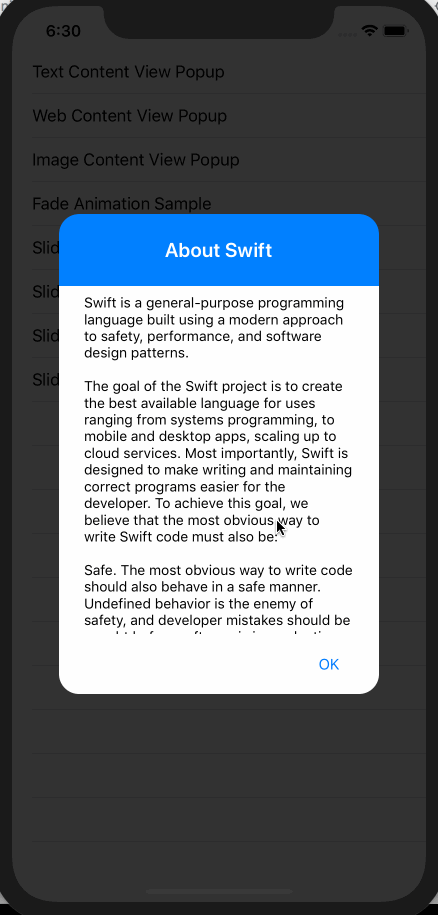
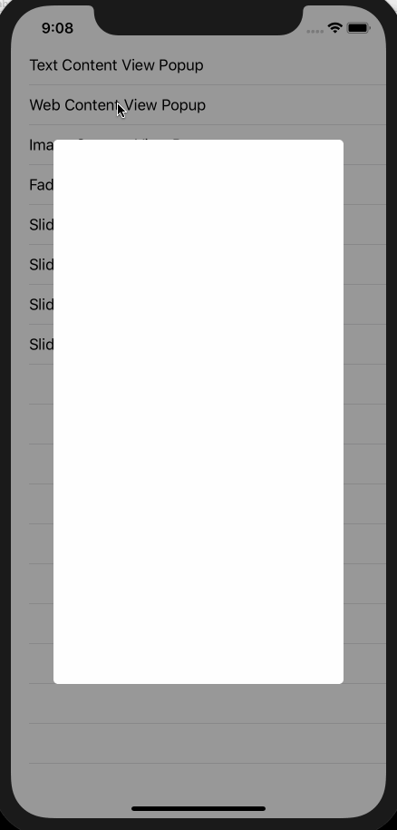
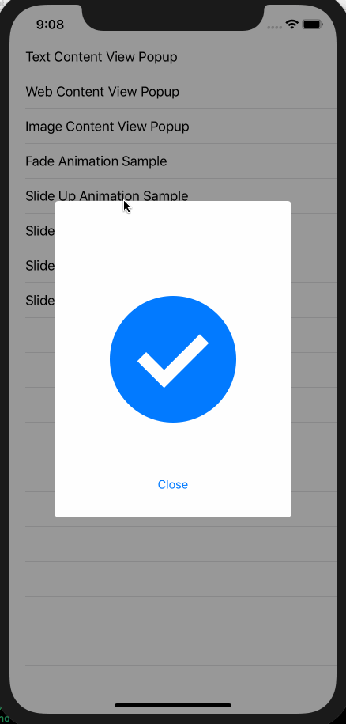
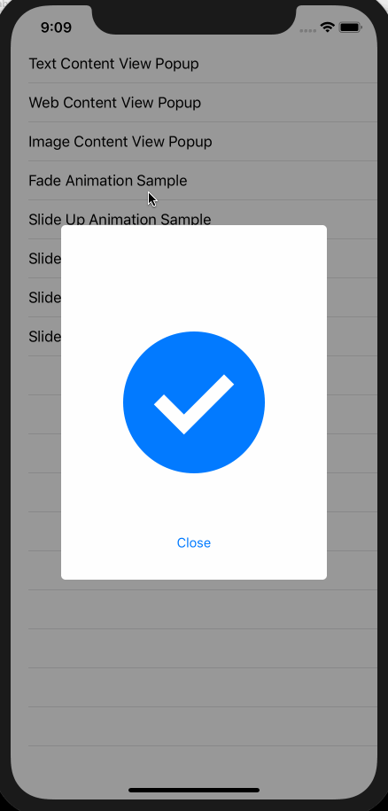
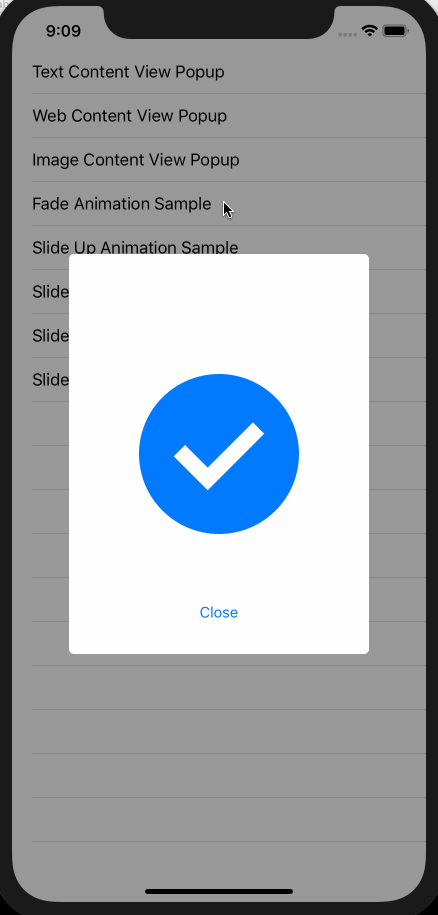
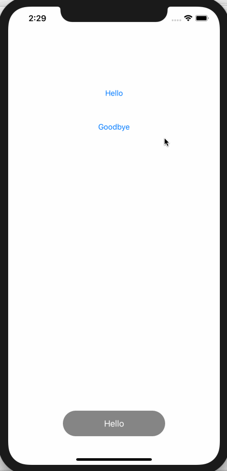
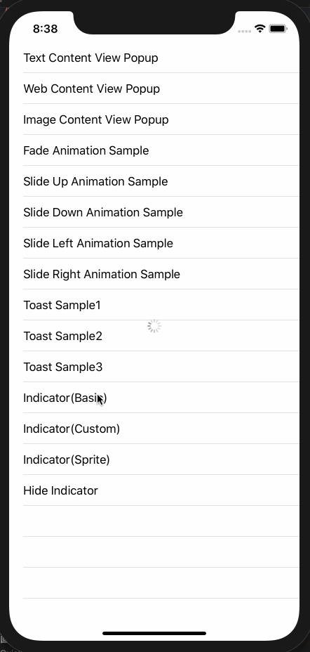
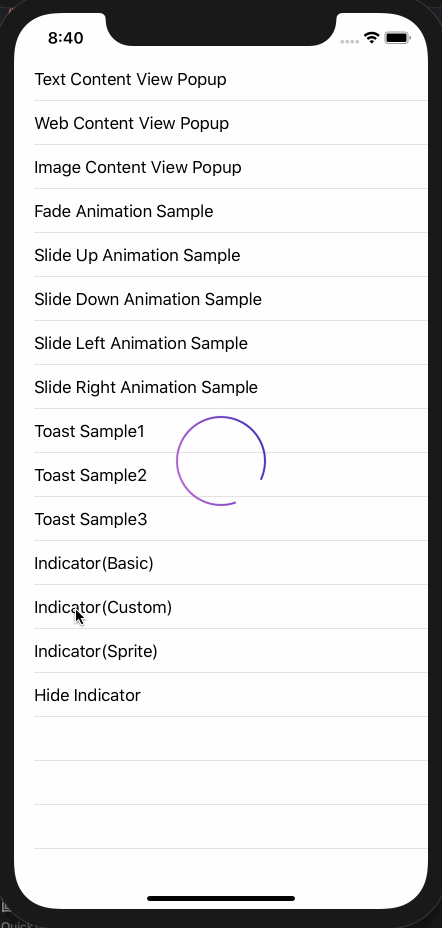
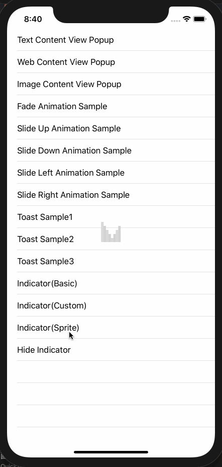

# MKAPopupKit

MKAPopupKit is the framework provides simple and customizable popup view for iOS. See following samples.

 

## Require

- iOS 9.3+
- Xcode 11.3+

## Get Started
### Install Framework to Your iOS App

You have three ways to install this framework.

#### 1. CocoaPods

MKAPopupKit is available through [CocoaPods](http://cocoapods.org). To install
it, simply add the following line to your Podfile:

```ruby
pod "MKAPopupKit"
```

#### 2. Carthage

You can use [Carthage](https://github.com/Carthage/Carthage) to install MKAPopupKit by adding it to your Cartfile:

```
github "HituziANDO/MKAPopupKit"
```

If you use Carthage to build your dependencies, make sure you have added MKAPopupKit.framework to the "Frameworks, Libraries and Embedded Content" section of your target, and have included them in your Carthage framework copying build phase.

#### 3. Manual Installation

1. Download latest [MKAPopupKit](https://github.com/HituziANDO/MKAPopupKit/releases) framework and copy it into your Xcode project
1. Open the "General" panel
1. Click on the + button under the "Frameworks, Libraries and Embedded Content" section
1. After click "Add Other...", choose MKAPopupKit.framework


### Quick Usage

1. Import the framework
	
	```swift
	import MKAPopupKit
	```
	
1. Create an instance
	
	Let's see following code. The MKAPopup can contain a content view has the layout created by you.
	
	```swift
	// Creates your content view.
	let contentView = ...YOUR CONTENT VIEW CREATION...
	// Creates a popup using your content view.
	let popup = MKAPopup(contentView: contentView)
	
	// Customizes...
	
	// Title (default is nil)
	popup.popupView.titleLabel.text = "About Swift"
	
	// Title Text Color (default is system default color)
	popup.popupView.titleLabel.textColor = .white
	
	// Title Font (default is system default font)
	popup.popupView.titleLabel.font = UIFont.boldSystemFont(ofSize: 20.0)
	
	// Title Text Padding (default is (16, 16, 16, 16))
	popup.popupView.titleLabel.padding = UIEdgeInsets(top: 24.0, left: 16.0, bottom: 24.0, right: 16.0)
	
	// Popup Background Color (default is white)
	popup.popupView.backgroundColor = UIColor(red: 0, green: 0.5, blue: 1.0, alpha: 1.0)
	
	// Popup Corner Radius (default is 5)
	popup.popupView.layer.cornerRadius = 20.0
	
	// Popup Size (default is (300, 400))
	popup.popupSize = CGSize(width: 320.0, height: 480.0)
	
	// Overlay Color (default is black with alpha=0.4)
	popup.backgroundColor = UIColor.black.withAlphaComponent(0.8)
	
	// Can hide when a user touches up outside a popup (default is true)
	popup.canHideWhenTouchUpOutside = false
	
	// Showing Animation (default is fade)
	popup.showingAnimation = .fade
	
	// Hiding Animation (default is fade)
	popup.hidingAnimation = .fade
	
	// Animation Duration (default is 0.3)
	popup.duration = 0.3
	
	// Delegate
	popup.delegate = self
	```
	
1. Show the popup
	
	```swift
	popup.show()
	```

1. Hide the popup
	
	```swift
	popup.hide()
	```

## Animation Types

The MKAPopup has some animations showing and hiding the popup.

### Fade


### SlideUp



### SlideDown


### SlideLeft



### SlideRight



## Toast

The toast is the view that disappears automatically after displaying a short message for a few seconds. It is inspired by Android's Toast.



### Most Simple Usage

It's very simple! See below.

```swift
MKAToast("Display short message!").show()
```

### Customize Toast

Customize the toast view and show it.

```swift
// Make the style.
let config = MKAToastStyleConfiguration()
config.width = 320.0
config.height = 56.0
config.backgroundColor = UIColor.red.withAlphaComponent(0.9)
config.textColor = .black
config.font = UIFont.systemFont(ofSize: 17.0, weight: .bold)

// Create the toast with options.
MKAToast("Something error occurred!", style: config)
    .withDelegate(self)
    .withTag(1)
    .withTime(MKAToastTimeLong)
    .withAnimationDuration(0.5)
    .withDelay(0.5)
    .show()
```

## Indicator

MKAIndicator makes you to create the powerful indicator view easily. See following samples.

**Basic Type Indicator**



**Custom Type Indicator**



**Sprite Animation Type Indicator**



### Most Simple Usage

1. Show the indicator
	
	```swift
	// Set default indicator.
   MKAIndicator.setDefault(MKAIndicator(activityIndicatorViewStyle: .medium))
	MKAIndicator.default().show(in: self.view, withTouchDisabled: false)
	```

1. Hide the indicator
	
	```swift
	MKAIndicator.default().hide()
	```

#### Style
#### Basic Type Indicator

The basic type indicator is simple using the style prepared by UIKit.

```swift
// Show the basic indicator.
let indicator = MKAIndicator(activityIndicatorViewStyle: .medium)
MKAIndicator.setDefault(indicator)
MKAIndicator.default().show(in: self.view, withTouchDisabled: false)
```

#### Custom Type Indicator

The custom type indicator uses an indicator image you created or prepared. The indicator image automatically rotates at the specified animation interval.

```swift
// Show the custom indicator with the image.
let indicator = MKAIndicator(image: UIImage(named: "spinner")!)
    .setAnimationDuration(2.0)
MKAIndicator.setDefault(indicator)
MKAIndicator.default().show(in: self.view, withTouchDisabled: false)
```

#### Sprite Animation Type Indicator

The sprite animation type indicator uses indicator images you created or prepared. Images are composed of the keyframe animation at the specified animation interval.

```swift
// Show the sprite animation indicator.
let indicator = MKAIndicator(imagesFormat: "indicator%d", count: 8)
    .setAnimationDuration(0.5)
MKAIndicator.setDefault(indicator)
MKAIndicator.default().show(in: self.view, withTouchDisabled: false)
```

----

More info, see my [sample code](https://github.com/HituziANDO/MKAPopupKit/tree/master/Sample).
